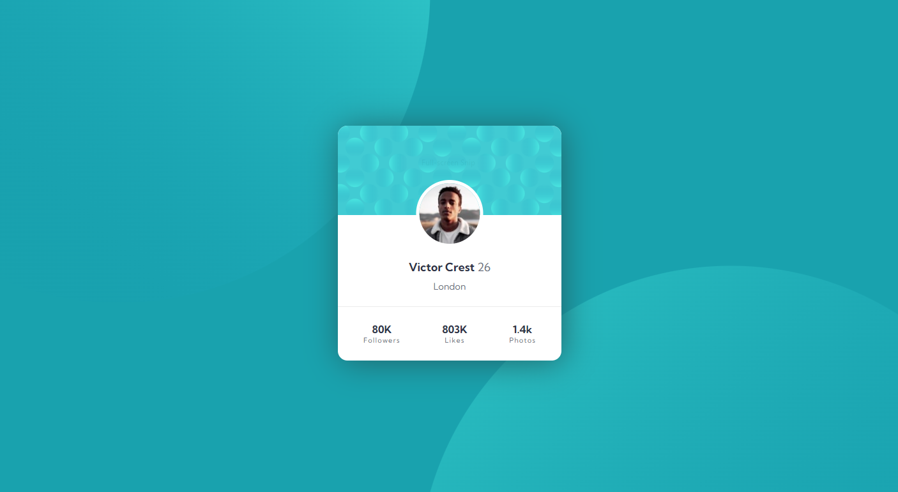

# Frontend Mentor - Profile card component solution

This is a solution to the [Profile card component challenge on Frontend Mentor](https://www.frontendmentor.io/challenges/profile-card-component-cfArpWshJ). Frontend Mentor challenges help you improve your coding skills by building realistic projects.

## Table of contents

- [The challenge](#the-challenge)
- [Screenshot](#screenshot)
- [Links](#links)
- [Built with](#built-with)
- [Author](#author)

### The challenge

- Build out the project to the designs provided

### Screenshot

### Links

- Solution URL: [solution URL](https://www.frontendmentor.io/solutions/profile-card-preview-component-with-html-and-sass-2JRC0GnCK)
- Live Site URL: [live site URL](https://nuelobeto.github.io/profile-card/)

### Built with

- Semantic HTML5 markup
- CSS custom properties
- Flexbox

## Author

- Frontend Mentor - [@nuelobeto](https://www.frontendmentor.io/profile/nuelobeto)
